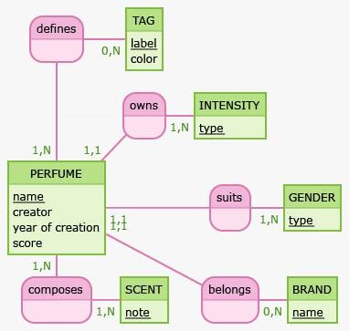

# API REST Perfume Catalog

Cette API permet de gérer une collection de parfums. 


## Réalisation
J'ai réalisé ce projet pendant ma spécialisation en back (API/Data) dans le cadre de ma formation en développement web FS JavaScript.

J'ai construit mes tables de données en suivant la loi de la 3FN et en définissant qu'elles étaient les informations impotantes à intégrer pour gérer au mieux une collection.



Une fois le MCD et le [MLD](app/../conception/mld.jpg) finalisés, j'ai défini des [users stories](app/../conception/user_stories.md), qui m'ont aidé à lister toutes les routes dont j'aurais besoin.

Pour coder ce projet, je me suis basée sur le design pattern Active Record.
J'ai effectué des tests unitaires sur chacun des schémas de données et j'ai utilisé Redis la mise en cache.

## Languages utilisés
- JavaScript 
- SQL

## Stacks
- Node.js
  - Express
  - Joi
  - Chai / Mocha
- PostgreSQL
  - Sqitch
- Redis
- JSDoc
  - Swagger

## Documentation 
Ce projet est documenté à ml'aide de JSDoc et du module `express-swagger-generator` (visible depuis l'adresse `http://<host>:<port>/api-docs`).

## Installation
**Pré-requis**
- [Node.js](https://nodejs.org/en/download/) et NPM
- [PostgreSQL](https://www.postgresql.org/download/)
- [Redis](https://redis.io/download)
- [Sqitch](https://sqitch.org/)

1. Cloner le repo 
- en utilisant la clé SSH
```
git clone git@github.com:sarah-maau/api-perfume-catalog.git
```
- en utilisant HTTPS
```
git clone https://github.com/sarah-maau/api-perfume-catalog.git
```

2. Installer les dépendances
```
npm i
```

3. Créer la base de donnée via PostgreSQL avec la commande
```
createdb <dbname>
```

4. Renommer le fichier `.env.example` en `.env` avec vos variables d'environnement

5. Déployer (via sqitch) avec la commande
```
sqitch deploy db:pg:<dbname>
```

6. Charger les données en lançant le script 
```
npm run seed
```

7. Lancer le script

```
npm start
```

8. Pour voir et tester les routes plus facilement, utiliser Swagger via
```
http://<host>:<port>/api-docs
```

## Auteur
Sarah Maury - [GitHub](https://github.com/sarah-maau) - [LinkedIn](https://www.linkedin.com/in/sarahmaurydev/)

## Licence
Ce projet est sous licence MIT - voir le fichier `LICENSE` pour plus de détails

