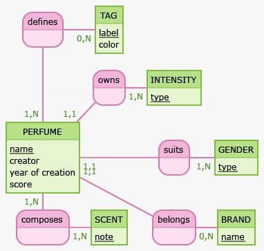

# MCD
## Entités et attributs
PERFUME: name, creator, year of creation, score  
BRAND: name   
TAG: label, color  
INTENSITY: type   
SCENT: note  
GENDER: type  

## Relations
**PERFUME <-> BRAND**
Un parfum appartient à une marque 

- verbe : belongs
- relation de type `1:N`
  - Brand => Perfume : une Brand détient 0 Perfume au minimum, et au maximum N Perfume = `0,N`
  - Perfume => Brand : un Perfume appartient au minimum à une Brand, au maximum par 1 Brand = `1,1`  
  
**PERFUME <-> TAG**
Un tag définit un parfum  

- verbe : defines
- relation de type `N:N`
  - Tag => Perfume : un Tag définit au minimum 0 Perfume, et au maximum N Perfume = `0,N`
  - Perfume => Tag : un Perfume est défini au minimum par un Tag, au maximum par N Tag = `1,N`  
  
**PERFUME <-> INTENSITY**  
Un parfum possède une intensité

- verbe : owns
- relation de type `1:N`
  - Intensity => Perfume : une Intensité est possédée au minimum par 1 Perfume, et au maximum N Perfume = `1,N`
  - Perfume => Intensity : un Perfume possède au minimum une Intensité, au maximum une Intensité = `1,1`
  
**PERFUME <-> SCENT**  
Une senteur compose un parfum

- verbe : composes
- relation de type `N:N`
  - Scent => Perfume : une Scent compose au minimum 0 Perfume, et au maximum N Perfume = `1,N`
  - Perfume => Scent : un Perfume est composé au minimum par 1 Scent, au maximum N Scent = `1,N`
  
**PERFUME <-> GENDER**  
Un parfum convient à un genre

- verbe : suits
- relation de type `1:N`
  - Gender => Perfume : un Genre "est convenu" pour au minimum 1 Perfume, et au maximum pour N Perfume = `1,N`
  - Perfume => Gender : un Perfume convient au minimum à un Genre, au maximum à un Genre = `1,1`

# MLD
- PERFUME: <ins>id</ins>, name, creator, year_of creation, score, #brand_id, #intensity_id, #gender_id
- TAG: <ins>id</ins>, label, color  
- INTENSITY: <ins>id</ins>, type  
- SCENT: <ins>id</ins>, note  
- BRAND: <ins>id</ins>, name
- GENDER: <ins>id</ins>, type
- PERFUME_HAS_TAG: <ins>id</ins>, #perfume_id, #tag_id
- PERFUME_HAS_SCENT: <ins>id</ins>, #perfume_id, #scent_id

